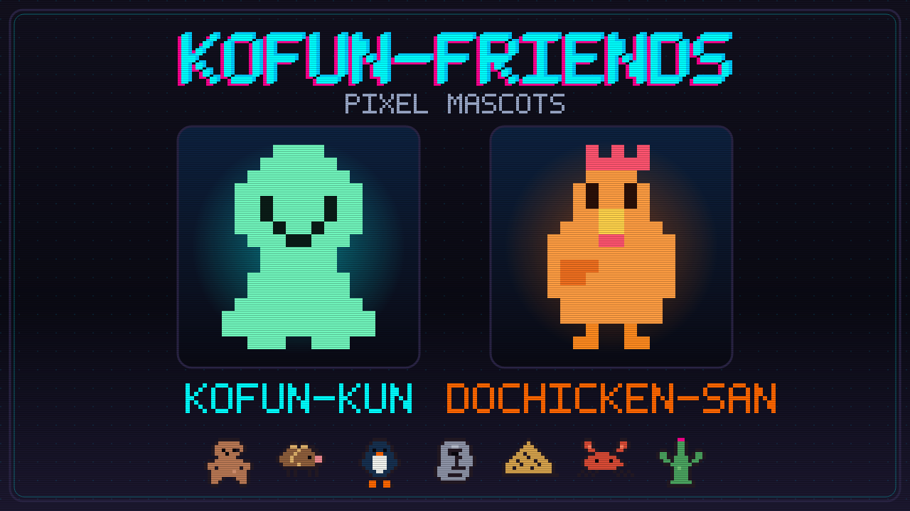

# kofun-friends

Kofun-kun / Dochicken-san と仲間たちのドット絵素材集です。

<p align="center">
  
</p>

## 使う

配布用ファイルは `dist/` にあります。

- `dist/kofun/`, `dist/dochicken/`: マスコットPNG/GIF
- `dist/emoji/`: 絵文字PNG
- `dist/backgrounds/`: 背景PNG
- `dist/motion/`: 動き確認用GIF/シート
- `dist/cursors/`: `.cur` / `.ani`
- `dist/lineup/`: 一覧画像

GitHub Releases からまとめて取得できます。

## 作る

```bash
scripts/regen.sh
```

これで `assets/` と `catalog/manifest.json` から `dist/` を作り直します。

個別変換:

```bash
tools/converter/target/release/kofun-convert batch
tools/converter/target/release/kofun-convert resize in.gif --width 96 --filter nearest
tools/converter/target/release/kofun-convert rasterize in.svg --width 512
```

## 置き場

- `assets/`: 原本
- `dist/`: 配布物
- `catalog/manifest.json`: 生成設定
- `scripts/`: 生成スクリプト
- `tools/converter/`: Rust製コンバータ
- `docs/`: 最小メモ

## メモ

- 素材追加: [docs/adding-assets.md](docs/adding-assets.md)
- 素材サイト: [docs/material-sites.md](docs/material-sites.md)
- converter: [tools/converter/README.md](tools/converter/README.md)

## ライセンス

- 素材: `catalog/manifest.json` の `license`
- 既定: CC BY 4.0
- converter: MIT
