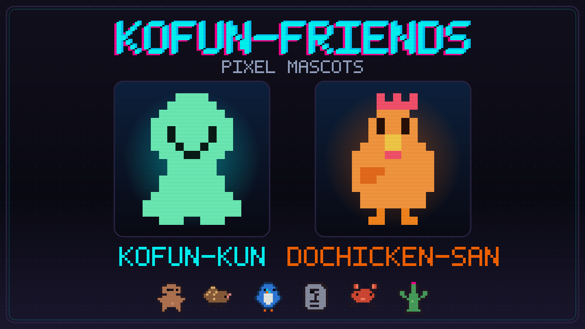

<!-- i18n: language-switcher -->
[English](README.md) | [日本語](README.ja.md)

# kofun-friends

A pixel-art asset set for Kofun-kun, Dochicken-san, and friends.

<p align="center">
  
</p>

## Using the assets

The distributable files live in `dist/`.

- `dist/kofun/`, `dist/dochicken/`: mascot PNG/GIF
- `dist/emoji/`: emoji PNG
- `dist/backgrounds/`: background PNG
- `dist/motion/`: GIFs and sheets for checking motion
- `dist/cursors/`: `.cur` / `.ani`
- `dist/lineup/`: overview images

They can be downloaded together from GitHub Releases.

## Building the assets

```bash
scripts/regen.sh
```

This rebuilds `dist/` from `assets/` and `catalog/manifest.json`.

Individual conversions:

```bash
tools/converter/target/release/kofun-convert batch
tools/converter/target/release/kofun-convert resize in.gif --width 96 --filter nearest
tools/converter/target/release/kofun-convert rasterize in.svg --width 512
```

## Layout

- `assets/`: originals
- `dist/`: distributables
- `catalog/manifest.json`: generation settings
- `scripts/`: generation scripts
- `tools/converter/`: the Rust converter
- `docs/`: short notes

## Notes

- Adding assets: [docs/adding-assets.md](docs/adding-assets.md)
- Asset sites: [docs/material-sites.md](docs/material-sites.md)
- Posting GitHub Issues to Daimon automatically: [docs/daimon-issue-posting.md](docs/daimon-issue-posting.md)
- converter: [tools/converter/README.md](tools/converter/README.md)

## Asset licensing

- Per asset: the `license` field in `catalog/manifest.json`
- Default: CC BY 4.0
- converter: MIT

## License

0BSD. You can use, copy, modify, and distribute this project for almost any purpose.
